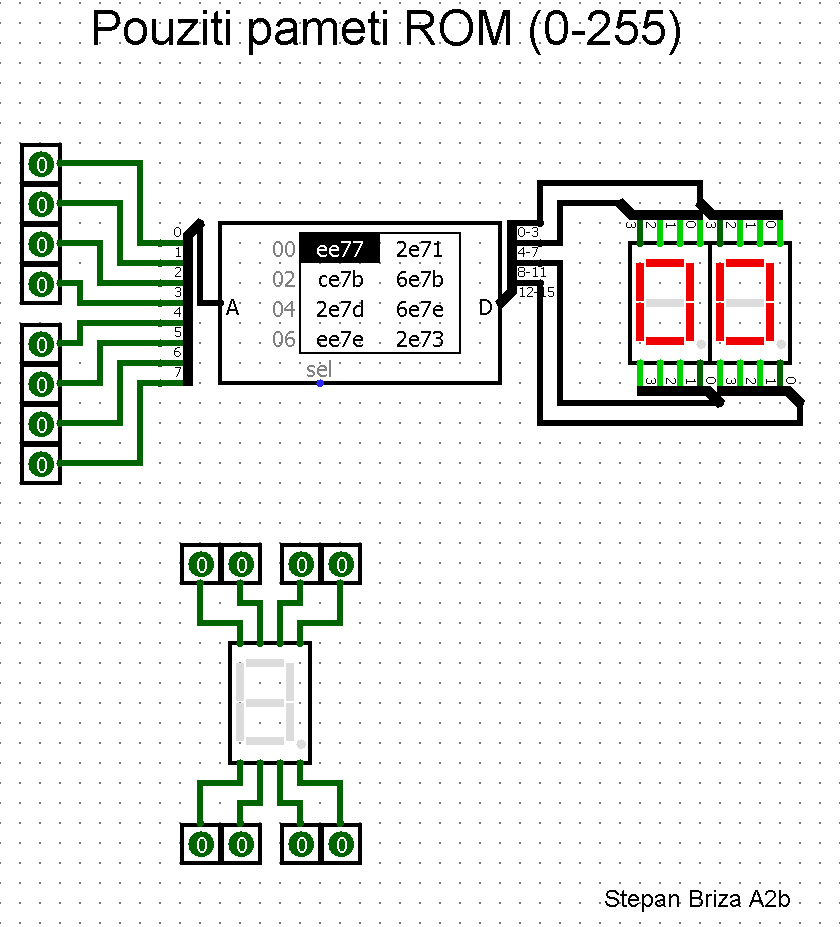

# Generator-7SefDisplay-HexNum-16x16

Simple program to ROM 8x inputs and 2x 7-segment displays. Creates bit combinations for 0-255

## Requirement

- None
- Makefile (Optional)

## Run

### MacOS/Linux

```bash
python3 src/main.py
```

### Windows

```bash
python src/main.py
```

### Make

```bash
make
```

### How it works ?

After running the script, you will get an output.txt file containing a 16x16 table of hexadecimal numbers. You can use this table in your [Logisim](https://sourceforge.net/projects/circuit/) project.


